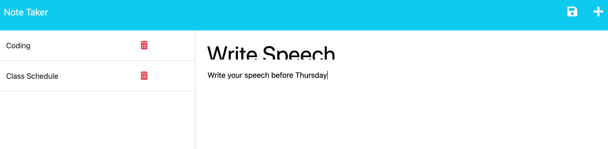

# note-taker

## Description
This note taker application is designed to create a simple platform for taking notes that can be saved, updated, and deleted. It contains a user-friendly interface, which makes it perfect for everyday use.  This was my first time deploying to Heroku, so this was a great opportunity to become acclimated with the process of Heroku deployment.  I also got the chance to learn more about accessing the req.body element.

## Table of Contents

1. [Installation](#installation)
2. [Usage](#usage)
3. [Credits](#credits)
4. [How to Contribute](#how-to-contribute)
5. [Tests](#tests)
6. [Questions](#questions)

## Installation
Head to the [note-taker](https://github.com/crissyg923/note-taker) repo and clone it to your local environment using the HTTPS method. Make sure to run the command 'npm i' to install the dependencies and be able to test the app as you make further developments.

## Usage
After cloning and installing dependencies, this app can be invoked by running the command 'node server.js'.  This will start your local server and allow you to view the app at localhost:3001.  Alternatively, you can head to the deployed link [HERE](https://pacific-lowlands-07554-38d07e4db431.herokuapp.com) and begin using the app.

## Credits
Starter code was provided for the HTML portion of the app. This app was also created with the help of a Rutgers tutor and the following link:
[Splice Array Method](https://www.freecodecamp.org/news/javascript-splice-how-to-use-the-splice-js-array-method/#:~:text=splice()%20JS%20Array%20Method,-Nathan%20Sebhastian&text=The%20splice()%20method%20is,elements%20as%20a%20new%20array.)

## How to Contribute
Someone can contribute to this project by furthering its functionality.  After cloning the repo, be sure to create a new branch where you will push changes so that they can be approved before merging.

## Tests
N/A

## License
MIT License
        Copyright (C) 2023 Crystal Green
        Permission is hereby granted, free of charge, to any person obtaining a copy
of this software and associated documentation files (the "Software"), to deal
in the Software without restriction, including without limitation the rights
to use, copy, modify, merge, publish, distribute, sublicense, and/or sell
copies of the Software, and to permit persons to whom the Software is
furnished to do so, subject to the following conditions:

The above copyright notice and this permission notice shall be included in all
copies or substantial portions of the Software.

THE SOFTWARE IS PROVIDED "AS IS", WITHOUT WARRANTY OF ANY KIND, EXPRESS OR
IMPLIED, INCLUDING BUT NOT LIMITED TO THE WARRANTIES OF MERCHANTABILITY,
FITNESS FOR A PARTICULAR PURPOSE AND NONINFRINGEMENT. IN NO EVENT SHALL THE
AUTHORS OR COPYRIGHT HOLDERS BE LIABLE FOR ANY CLAIM, DAMAGES OR OTHER
LIABILITY, WHETHER IN AN ACTION OF CONTRACT, TORT OR OTHERWISE, ARISING FROM,
OUT OF OR IN CONNECTION WITH THE SOFTWARE OR THE USE OR OTHER DEALINGS IN THE
SOFTWARE. 

## Questions
Crystal Green

(862) 205-9019

crissybrown1992@icloud.com

[Github](https://github.com/crissyg923)